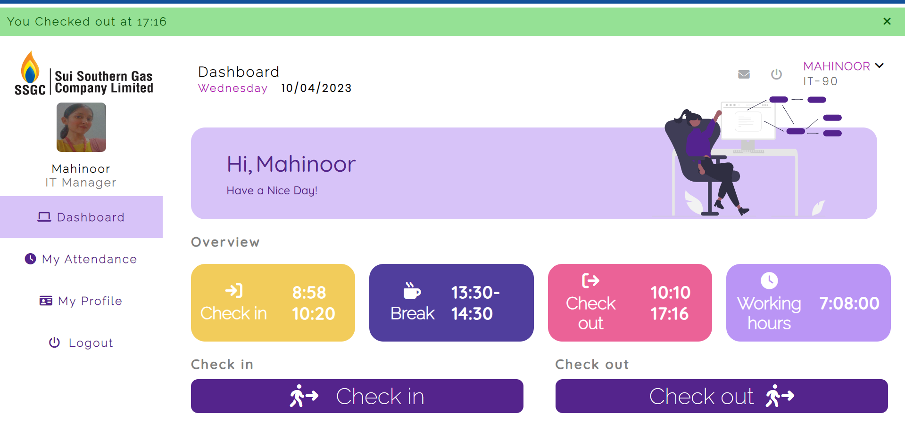

# EmployeePortal

1. Employee Portal
   Overview:
   The Employee Portal developed during my internship is a cutting-edge web-based platform
   designed to streamline attendance tracking and management for employees and
   administrators alike. This feature-rich portal offers a wide array of functionalities to enhance
   efficiency and convenience in daily work routines.
   Employee Features:

1) User-Friendly Interface:
   Upon creating an account and logging in, employees are greeted with a user-friendly and
   personalized dashboard, providing easy access to various features.
2) Attendance Tracking:
   Employees can seamlessly mark their attendance by checking in upon arrival and checking
   out at the end of the day. In cases of personal errands, employees can check out and check
   back in upon return, ensuring accurate tracking of daily working hours.
3) Personalized Profile:
   A dedicated section allows employees to access and manage their personal information,
   promoting data accuracy and privacy.
4) Communication:
   The portal includes an integrated email system, enabling employees to send messages directly
   to the admin, streamlining intra-organizational communication.
5) Attendance History:
   Employees can view their attendance records for the current month, fostering transparency
   and accountability

Administrator Features:

1. Attendance Monitoring:
   Administrators have the ability to view employee attendance records, with search
   options based on employee IDs or specific months and years, simplifying attendance
   oversight.
2. Employee Data Management:
   Admins can efficiently manage and update employee personal information,
   contributing to streamlined HR processes.
   Data Management:
   All data, including attendance records and personal information, is securely stored in
   a database, ensuring data integrity and accessibility.
   In summary, the Employee Portal represents a significant leap in workforce
   management, providing employees with a user-friendly interface for attendance
   tracking and access to their personal information. Simultaneously, administrators
   benefit from streamlined attendance monitoring and employee data management.
   This digital solution not only enhances productivity but also fosters transparency and
   communication within the organization.
   Technologies Used:
   The web portal was built using a stack of technologies for functionality and user-friendliness. HTML, CSS, and JavaScript handled the frontend for visually appealing
   and responsive interfaces. Django, a Python web framework, managed server-side
   logic, authentication, and data. MySQL powered data-driven aspects, creating an
   efficient ecosystem for a feature-rich user experience.

